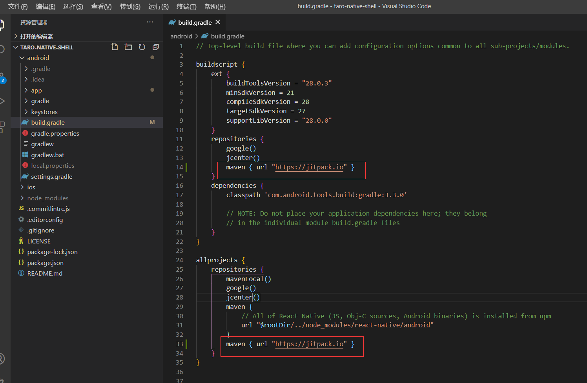

# taro 框架 React Native 端开发流程

## 一. 环境搭建

[taro 官网教程](https://taro-docs.jd.com/taro/docs/2.x/react-native/)

[React Native 官网教程](https://www.reactnative.cn/docs/0.59/getting-started.html)

> taro 版本：2.x

> React Native 版本：0.59.9

## 二. 编译


### 启动项目
taro 项目执行以下命令，编译后的代码及应用文件在根目录的 rn_temp 目录下
```
npm run dev:rn
```

编译成功后，如果没有自动打开一个终端，可在项目根目录下运行：
```
react-native start
```
默认会在 8081 端口启动，可能端口会被占用

然后，在浏览器依次输入以下链接， 会触发对应终端平台的 js bundle 构建

> http://127.0.0.1:8081

> http://127.0.0.1:8081/rn_temp/index.bundle?platform=android&dev=true


### android

在 taro-native-shell/android 目录下，执行

```
react-native run-android
```

*报错：Could not find com.github.yalantis:ucrop:2.2.2-native*

解决方法：


## 三. 打包

1. taro 项目执行 ```npm run build:rn```

    生成 rn_bundle 文件夹，将 rn_bundle 和 rn_temp 文件夹下的文件都 copy 到 taro-native-shell 下

    *注意 taro-native-shell 下的 package.json 文件也要新增 taro 依赖*

2. 然后按照官网教程即可


    [打包APK](https://reactnative.cn/docs/signed-apk-android)